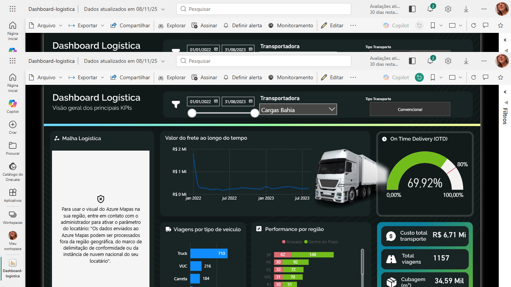

# dashboard-logistica
# Dashboard de Análise de Logística - Power BI  Este projeto é um dashboard interativo focado na análise de performance de uma operação logística, identificando custos, eficiência de entregas e gargalos operacionais.  ## 🎯 Objetivo (Descreva aqui o problema. Ex: O objetivo era analisar a eficiência das entregas, identificar o custo por rota e entender os principais motivos de atraso.)  ## 🛠️ Ferramentas * Power BI Desktop * Power Query (para ETL) * DAX (para métricas avançadas)  ## 📖 O Processo (Descreva o que você fez. Ex: Os dados foram importados, tratados no Power Query para limpar valores nulos e criar colunas condicionais. No Power BI, criei um modelo estrela e desenvolvi métricas DAX como "Custo Médio por KM" e "Taxa de Entregas no Prazo (OTIF)".)  ## 📊 O Dashboard  ### Visão Principal (Aqui mostramos a tela principal)   ### Análise Interativa (Filtros) (Aqui provamos a interatividade) Abaixo, um exemplo do dashboard filtrado para uma região específica, mostrando como os KPIs se adaptam:   --- *Você pode baixar o arquivo `.pbix` original deste repositório para explorar a modelagem e as fórmulas DAX.*
